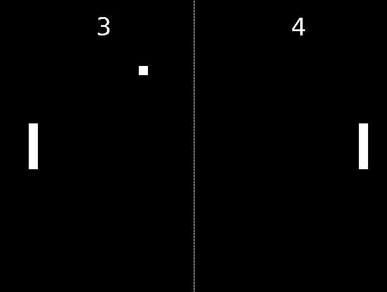

# pong

Pong game written using SDL.  
Based off the tutorial from https://austinmorlan.com/posts/pong_clone/.

## Things I Learned From Writing This

- SDL (Window, Graphics, Audio, Font)
- Game Loop
- Object-oriented design in C++ (inheritance, virtual methods, RAII, ...)

## Dependencies

- C++ 17  
- SDL 2.0  
- SDL_ttf 2.0