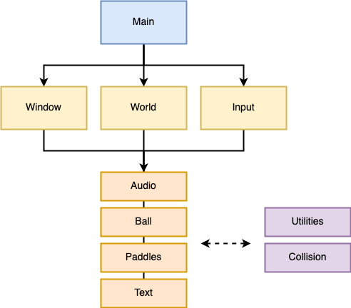

# pong

Pong game using C++ and SDL.

## Features

- Basic functionality (rendering, input, ...)
- Fixed timestep game loop
- Score counters
- Sound effects
- Pause button
- AI opponent
- Identify which side of an object collided another object

## Design

### Class Diagram

  
Note: the arrows roughly show who talks to who. The arrows don't indicate  inheritance.

### Class Descriptions

Main - the main game loop  
Window - the window and renderer  
World - the objects in the game  
Input - keep track of which keyboard keys are pressed  

Audio - plays sounds  
Ball - ball  
Paddle - paddle  
Text / Score - text  

Utilities - simple data structures  
Collision - collision algorithms

## Dependencies

- C++ 17  
- SDL2  
- SDL2_ttf
- SDL2_mixer
